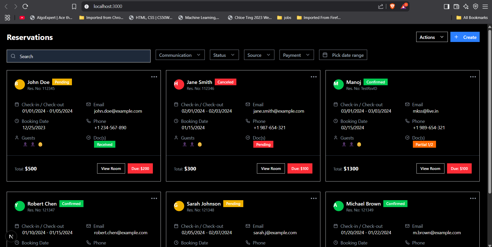

# Reservation Dashboard

A modern, responsive reservation management system built with Next.js, TypeScript, Tailwind CSS, and Shadcn UI.



## Features

- **Modern UI**: Clean, dark-themed interface for professional reservation management
- **Responsive Design**: Fully responsive grid layout that works on all device sizes
- **Reservation Cards**: Detailed cards showing guest information, booking details, and payment status
- **Filtering System**: Filter reservations by communication, status, source, and payment
- **Date Range Selection**: Filter reservations by date range
- **Search Functionality**: Search through all reservations

## Tech Stack

- **Framework**: [Next.js](https://nextjs.org/)
- **Language**: [TypeScript](https://www.typescriptlang.org/)
- **Styling**: [Tailwind CSS](https://tailwindcss.com/)
- **UI Components**: [Shadcn UI](https://ui.shadcn.com/)
- **Icons**: [Lucide React](https://lucide.dev/)

## Getting Started

### Prerequisites

- Node.js 18+ and npm/yarn installed on your machine

### Installation

1. Clone the repository:
```bash
git clone https://github.com/akash2704/reservation-dashboard.git
cd reservation-dashboard
```

2. Install dependencies:
```bash
npm install
# or
yarn install
```

3. Run the development server:
```bash
npm run dev
# or
yarn dev
```

4. Open [http://localhost:3000](http://localhost:3000) in your browser.

## Project Structure

```
reservation-dashboard/
├── app/
│   └── page.tsx           # Main dashboard page
├── components/
│   ├── ReservationCard.tsx # Reservation card component
│   └── ui/                # Shadcn UI components
├── public/                # Static assets
└── styles/                # Global styles
```

## Component Overview

### ReservationCard

The ReservationCard component displays detailed information about each reservation:

- Guest name and status (Confirmed, Pending, Canceled)
- Reservation ID
- Check-in and check-out dates
- Contact information (email, phone)
- Booking date
- Number of guests (adults and children)
- Documentation status
- Total amount and amount due

### Dashboard Page

The main dashboard page includes:

- Header with title and action buttons
- Filter bar with search and dropdown filters
- Responsive grid of reservation cards

## Customization

### Styling

The project uses Tailwind CSS for styling. You can customize the theme in:

1. The `tailwind.config.js` file
2. The `globals.css` file for global styles

### Adding New Components

To add new Shadcn UI components:

```bash
npx shadcn-ui@latest add [component-name]
```

## Deployment

This Next.js app can be deployed on platforms like Vercel, Netlify, or any other hosting service that supports Next.js applications.

For Vercel deployment:

1. Push your code to a Git repository (GitHub, GitLab, Bitbucket)
2. Import the project on [Vercel](https://vercel.com)
3. Deploy with the default settings

## Acknowledgements

- [Next.js Documentation](https://nextjs.org/docs)
- [Tailwind CSS Documentation](https://tailwindcss.com/docs)
- [Shadcn UI Documentation](https://ui.shadcn.com/docs)
- [Lucide Icons](https://lucide.dev/)
